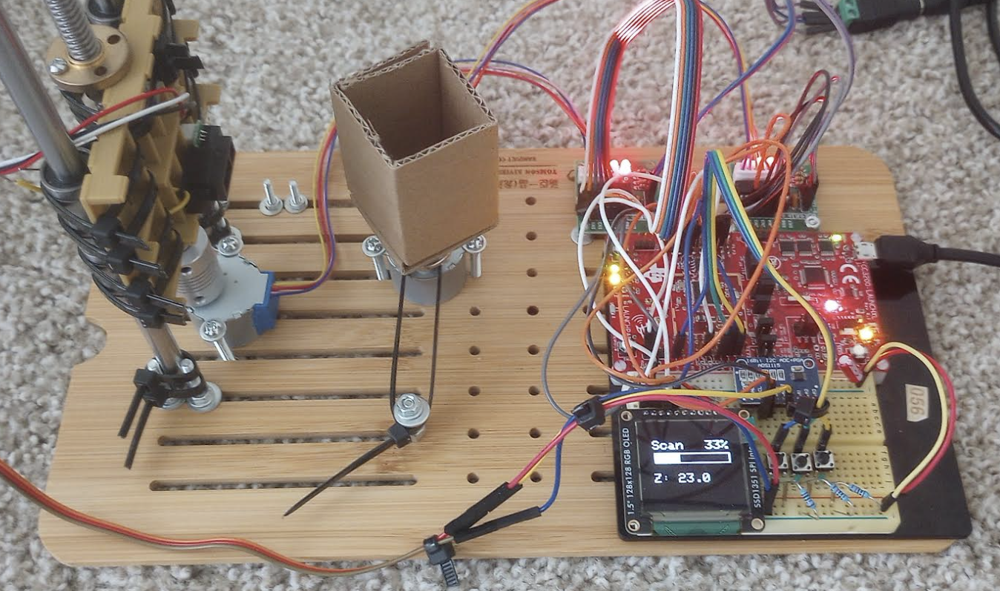
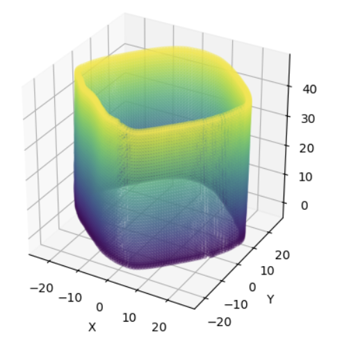

# 3D Scanner Project

[![IMAGE ALT TEXT HERE]](https://www.youtube.com/watch?v=gsEvquIuEU4)

**Author:** Nghi Dao

## Abstract

The 3D scanner is a device designed to map out the surface of small 3D objects using a point cloud. The scanner collects data and uploads it to Amazon AWS DynamoDB via AWS IoT. The data can then be downloaded and visualized using Python.

## Design

### Functional Specification

The scanner begins in an idle state, allowing the user to:
- Adjust settings
- Move motors
- Start or pause scans

During a scan:
- Data is collected layer-by-layer
- Raw measurements are sent to an AWS IoT Thing Shadow
- Data exceeding the Thing Shadow's limits is transferred to AWS DynamoDB

### Architecture

The scanner is controlled by a **CC3200 Launchpad**. Key components include:
- **Buttons:** For user interaction
- **OLED Display:** Displays scanner state and settings
- **IR Sensor:** Reads object surface data (connected via a 16-bit ADC due to voltage constraints)
- **Stepper Motors:** Controlled via stepper motor drivers to handle higher currents
- **AWS IoT & DynamoDB:** Handles data storage and transfer

## Implementation

The code is modular, with each component operating independently. Key components:
- **User Input:** Button presses are tied to interrupts, ensuring responsiveness even during long operations.
- **Stepper Motors:** Tracks rotation, speed, and timing to ensure precise movements.
- **Scanning Logic:** Coordinates IR sensor readings with motor states to ensure accurate measurements.
- **User Interface:** Efficient OLED updates minimize delays.
- **Visualization:** Data from DynamoDB is visualized in Python using `matplotlib` to create a point cloud.

### Visualization Example

After scanning, the data is downloaded as a CSV file and visualized. Below is an example of a generated point cloud.

## Challenges

1. **Hardware Stability:** Without a 3D printer, components were secured using household items like zipties and a tea table.
2. **Analog Signal Reading:** The IR sensor exceeded the onboard ADC's voltage limits, resolved by using an external ADC.
3. **AWS IoT Limitations:** Data size constraints required transferring data layer-by-layer to DynamoDB.

## Future Work

- **Camera Integration:** Replacing the IR sensor with a camera for higher precision and faster scans.
- **Motor Upgrade:** Using bipolar stepper motors (e.g., Nema 17) for better precision and torque.
- **Automated Reconstruction:** Automating the process of downloading, reconstructing, and visualizing scanned data.

## Bill of Materials

The total project cost was approximately **$40**. Below is the breakdown:

| Item                          | Source   | Cost/Unit | Quantity Used | Total Cost |
|-------------------------------|----------|-----------|---------------|------------|
| 28BYJ-48 Stepper Motor        | Amazon   | $2.66     | 3             | $7.99      |
| Linear Ball Bearing LM8UU     | Amazon   | $0.83     | 2             | $1.67      |
| Micro Limit Switch            | Amazon   | $0.60     | 1             | $0.60      |
| Lead Screw T8 200mm           | Amazon   | $8.99     | 1             | $8.99      |
| 5mm to 8mm Coupler            | Amazon   | $3.25     | 1             | $3.25      |
| 8mm x 250mm Linear Rod        | Amazon   | $4.00     | 2             | $7.99      |
| GP2Y0A51SK0F IR Sensor        | Amazon   | $11.99    | 1             | $11.99     |
| Scraps                        | Apartment| $0.00     | 2             | $0.00      |

**Total Cost:** $39.81

## Contributions

- **Nghi Dao:** Single person team. Completed all tasks.
